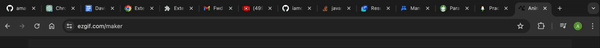
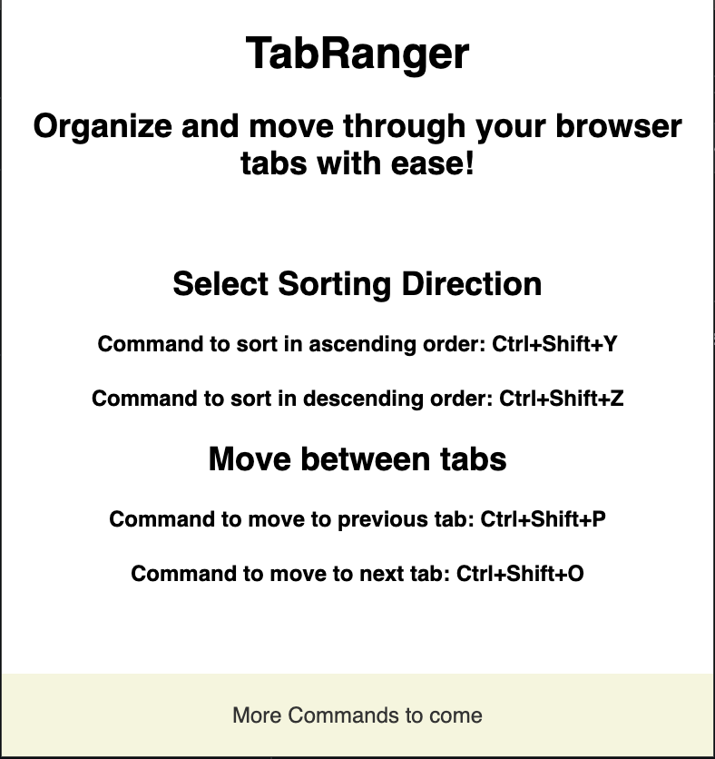

## Overview
This extension streamlines tab management and enhance navigation efficiency. It enables users to seamlessly toggle beteween tabs and sort them in ascending or descending order. With this extension, you can declutter your workspace and elevate your browsing journey.

## Installation
- This extension is not yet published, once published the link will be posted

## Usage
To use this extension there are some commands
- Arrange Ascending: Ctrl+Shift+Y or Command+Shift+Y
- Arrange Descending: Ctrl+Shift+Z or Command+Shift+Z
- Move to previous tab: Ctrl+Shift+P or Command+Shift+P
- Move to next tab: Ctrl+Shift+O or Command+Shift+O

## Features
- Sorting tabs in an ascending order
- Sorting tabs in a descending order
- Moving between tabs
- More to come ......

## Screenshots or GIFS

## Permissions
- This extension request permissions for tabs

## Troubleshooting
If any errors encountered
- Make sure to clear cache
- If you have an adblock you can try whitelisting

## Problems Encountered
- Jest Setup (created a jest config file)
- ERR_BLOCKED_BY_CLIENT (args was the fix)
- Module types and imports (used bundles but then placed everyhting in one file)
- Service worker randomly not registering (have not figured out a fix)
- do not put service worker in a sub directory